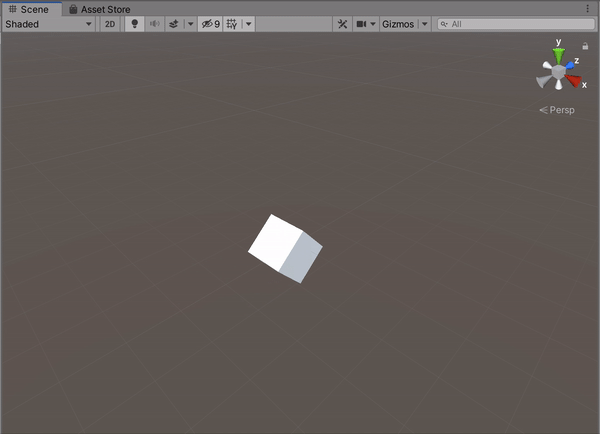
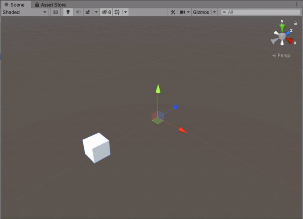
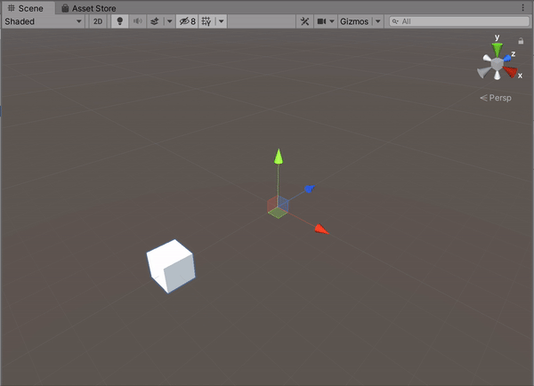
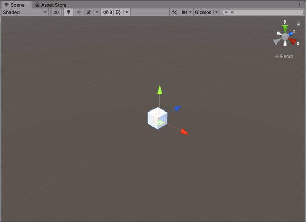
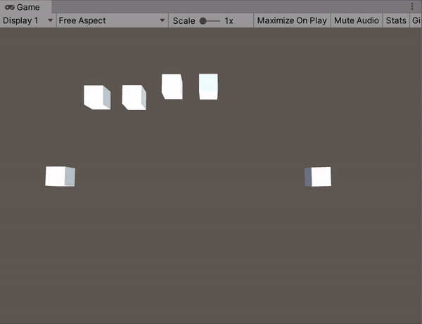
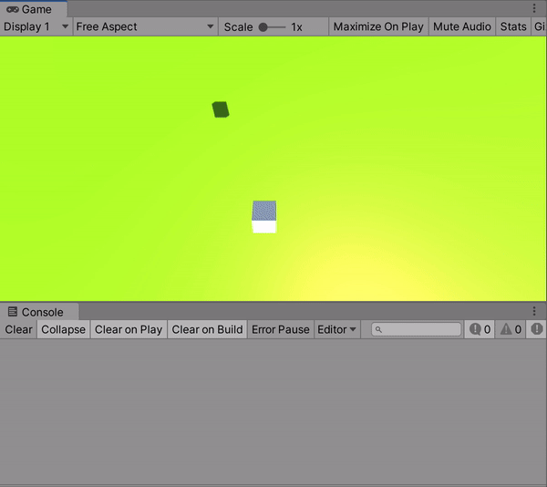
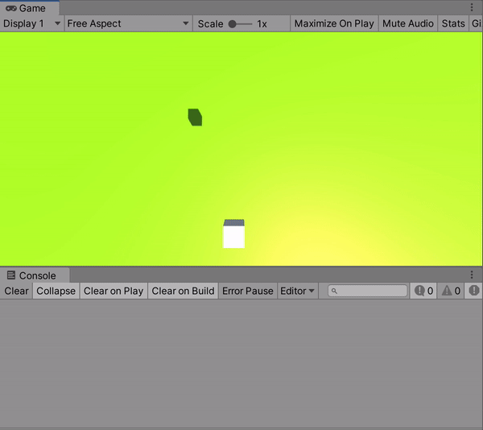
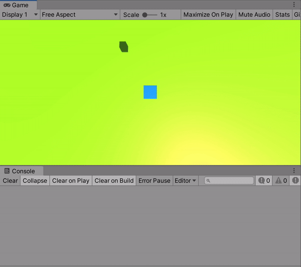

**The University of Melbourne**
# COMP30019 – Graphics and Interaction

## Workshop 4

# Introduction:

In this workshop you will be learning how to apply linear transformations to objects, 
as well as how to utilise basic user input to control game objects. You'll also be exploring
how a variable framerate impacts physical simulations, where object transforms change over time.
There are two files present in the assets folder:
* **MainScene.unity** – The Unity scene to open and modify in this workshop.
* **XAxisSpin.cs** – A component which spins the object it is attached to about its _local_ x-axis.

> **Note**  
> Some of the tasks today require basic knowledge of Newtonian motion (nothing more than highschool level physics). 
> If you end up finding this aspect of the workshop challenging, 
> make a note to do a bit of revision at some point. 
> While we normally use the Unity physics engine to assist with complex physical simulations, 
> basic theoretical knowledge is still important to use it correctly. Sometimes we 
> also still need to control game objects "manually".

### Tasks:

#### 1. Scripting lifecycle basics

Open `MainScene.unity` in Unity. Press the ‘Play’ button and take a look at the cube object – currently it will be spinning about its x-axis. Open the script `XAxisSpin.cs` to examine how this done. 

In particular, note the use of the `Update()` method to incrementally rotate the cube.
This is called by the Unity engine on every frame of the game, _before_ rendering of the scene
is performed. In previous workshops you've already seen the `Start()` method, 
which is called _once_ before the first `Update()` call. Often this is
used for initialisation of variables and/or initial loading of resources
required by the respective component throughout its lifespan. It's best to keep logic
in the `Update()` method as efficient as possible, since it has a direct 
impact on the simulation frame rate.

> **Note**  
> There are two other "update" methods in the scripting lifecycle: `LateUpdate()`
> and `FixedUpdate()`. Similarly, there is a `Start()` method "alternative" called
> `Awake()`. There are subtle, but important differences between these. 
> At some point it's worth reading [this page](https://docs.unity3d.com/Manual/ExecutionOrder.html)
> in the Unity docs to better understand the full Unity scripting lifecycle, because sometimes
> _execution order_ matters. However, for the remainder of this workshop we'll 
> stick with `Start()` and `Update()` to keep things simple.

In an ideal world, each frame would be rendered in fixed intervals so that the 
speed of animated objects is consistent. However, there is usually
significant variance in the specs of end-user machines, which means the rendering
framerate will vary accordingly. Even on identical machines, other variables may
impact performance, e.g., use of multiple programs simultaneously. Who knows, some users 
might even _deliberately_ attempt to reduce the framerate to "cheat" by slowing down
the pace of the game!

To address this issue, we can "normalise" object transformations with respect to time.
In the x-axis spin script, `Time.deltaTime` is used to adjust the amount of rotation
in a given frame according to how much time has elapsed since the previous one. This 
is just your classic [equations of motion](https://isaacphysics.org/concepts/cp_eq_of_motion) in
action, e.g., `displacement = velocity * time`. It might be worth getting out your highschool physics textbook!

> **Note**  
> Use of the `FixedUpdate()` method is another approach for addressing this problem,
> by allowing us to separate "physics" updates from regular frame updates. This will
> be discussed in more detail when we look at the Unity physics engine in a few weeks' time.

#### 2. Spin using "total" time instead of "delta" time

Instead of rotating the cube incrementally based on the _change_ in time since the last update, 
we could instead re-compute the exact rotation
of the cube on every frame by using the _total_ time elapsed since the start of the
game. Let's try this out. Open `XAxisSpin.cs` and change `Time.deltaTime` to `Time.time` (read more
about the Unity `Time` class [here](https://docs.unity3d.com/Manual/TimeFrameManagement.html)). 
You then need to make a
further (tiny) modification to make the applied rotation _absolute_ instead of _relative_. When this
is working correctly, there should be no notable difference from the previous approach in play mode.

Practically speaking is there any difference between the two approaches? Think about the potential
pros and pitfalls of each. To get you started, here are a few questions:

- Would the cube have the same "angle" if it was created sometime after the game started?
- How does floating point precision and variable framerate (potentially) impact either approach?
- Which approach is simpler if the cube should be rotated _only if_ the user holds down a key?

If you're unsure about any of these, complete the workshop first and revisit them later. 
An important takeaway from today's workshop should be to always consider how physical simulations
are impacted by a variable framerate, or more generally, a _finite_ series of time steps.
Things can get especially unpredictable when
objects are able to collide with each other, or [move very fast](https://www.aorensoftware.com/blog/2011/06/01/when-bullets-move-too-fast/), hence why we usually opt to use the Unity
physics engine when things get complex. But we'll save that for another workshop.

#### 3. More cubes!

Your next task is to create five additional cubes,
replicating the movements shown below as closely as possible. You should aim to
maximise script re-use, that is, make use of the scene hierarchy (parent-child 
relationships) and strategic attachment of components to avoid writing a separate script
for every cube. It's possible to create cubes A-D with the x-axis spin script, and 
just one additional script!

* Cube A: _Moves back and forth in the z-axis_

  

* Cube B: _Moves back and forth in the z-axis whilst rotating about the local x-axis_

  

* Cube C: _Orbits about the x-axis_

  

* Cube D: _Orbits about the x-axis while locally rotating about the x-axis_

  

* Cube E: _Performs a ‘figure 8’ motion (challenge)_

  

#### 4. Bird's eye view

Adjust the camera's transform so that it looks vertically downwards at the cubes. 
All the cubes should be visible from the ‘Game’ tab when the simulation 
is running.

  

#### 5. Respond to user input

Write a component that allows you to move the original cube with the _arrow keys_ on the 
keyboard (in the X-Z plane). You will need to use the Unity engine `Input`
class within the script. Like always, you can (and should) check out the API for the `Input` 
class in the [Unity docs](https://docs.unity3d.com/ScriptReference/Input.html).
At this point it's probably worth adding a static object to serve as the "ground",
or an arbitrary reference point that _doesn't_ move. We've made 
this a green plane in the example below.

  

#### 6. Simulate some forces!
Write a similar component that allows you to `accelerate` the original cube 
with the arrow keys on the keyboard (in the X-Z plane). For example, 
pressing the right arrow will increase the _velocity_ of the cube in the 
positive x-axis. Remember to disable the previous movement script 
component from the cube before attaching this one.

_Hint:_ In your component, you'll probably want to create a private `Vector3` structure to hold the object's
current `velocity`. Every frame, you should update this variable based on user
input instead of directly changing the object's position ("displacement" in physics talk).
However, you'll _also_ need to use this variable to update the object's position every frame!

  

#### 7. Switch your play style

Write a component which switches the cube between using the movement 
script and the acceleration script when the ‘s’ key is pressed. To do this
the component should keep/get references to the two motion components and 
enable/disable them accordingly.
Additionally, switch the _material_ of the cube respectively, such that it is 
blue when the movement script is enabled, and red when the acceleration 
script is enabled.

  

#### 8. Track the protagonist

Currently the cube can move outside the bounds of the camera view. Create a
component, which is to be attached to the camera game object, that tracks the 
cube by rotating to "look at" it. The script should theoretically 
allow _any_ game object to be tracked, not specifically the cube, so make sure
you make the _target_ game object a serialized/public field.

> **Note**  
> You aren't expected to manually calculate the camera's rotation, 
> as this would be a fairly complex exercise. Instead, you may use 
[`Quaternion.LookRotation()`](https://docs.unity3d.com/ScriptReference/Quaternion.LookRotation.html) 
> or other Unity engine helper methods to compute the respective rotation for you.

  

